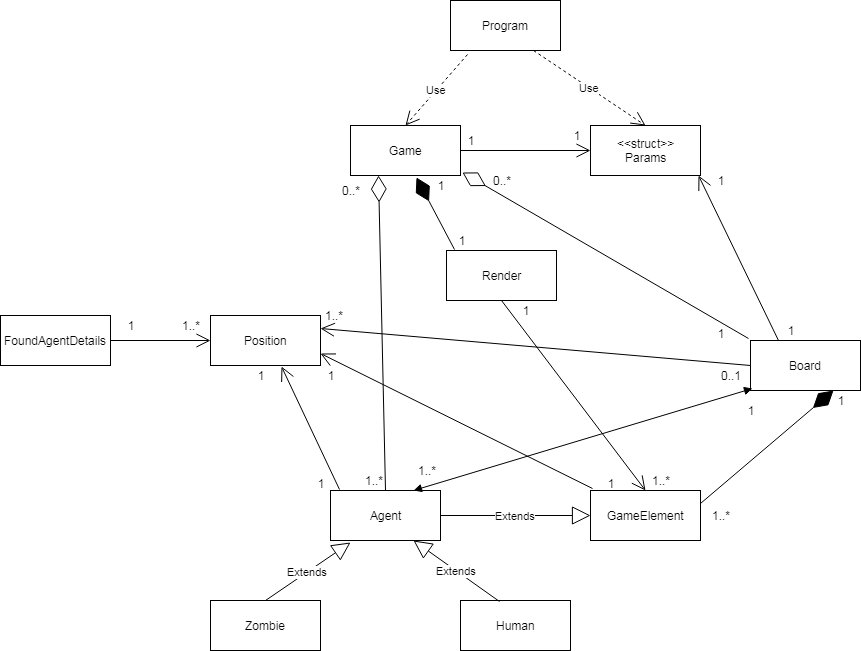
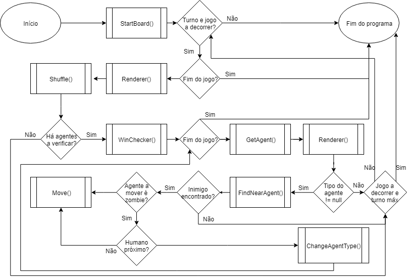

# Relatório do 2º Projeto de Linguagens de Programação I

## Humans Vs. Zombies

**Projeto realizado por:**
- [Guilhereme Saturno, a21700118]()
- [Lucas Viana, ]()
- [Pedro Inácio, a21802050]()

## Indicação do trabalho realizado pelos membros do grupo:

- Guilherme Saturno:
  - Criação e desenvolvimento da classe `Render`;
  - Criação e desenvolvimento da primeira versão do comportamento do movimento 
  da classe `Agent`;
  - Criação da base da classe `Board`;
  - Alterações da criação do `AgentID` para hexadecimal;
  - Criação e desenvolvimento do controlo manual usado em `Agents` controlados 
  pelo utilizador;
  - Documentação XML do programa;
  - Fluxograma, com Lucas Viana e Pedro Inácio.

- Lucas viana:
  - Criação e definição da lógica básica das classes `Board`, `Character` e 
  `Position`, com Pedro Inácio;
  - Criação e desenvolvimento das classes `GameElement`, `FoundAgentDetails`, 
  por completo;
  - Desenvolvimento da classe `Board` na sua maioria;
  - Alteração, melhoramento e desenvolvimento do comportamento do movimento 
  desenvolvido por Guilherme Saturno das classes `Agent` e `Human`, baseado 
  no que foi feito por Guilherme Saturno;
  - Criação das enumerações `Type` e `ControlType`;
  - Criação e desenvolvimento do método `Shuffle()`, concluindo-o com o 
  algoritmo _Fisher-Yates_;
  - Alterações e desenvolvimentos na classe `Render`.
  - Adição de condição de _shutdown_ à _struct_ `Params`;
  - Organização do código, vários _fixes_ e comentários;
  - Realização de parte do relatório, em conjunto com Pedro Inácio, e diagrama
   UML do projeto.

- Pedro Inácio:
  - Criação e definição da lógica básica das classes `Board`, `Character` e 
  `Position`, com Lucas Viana;
  - Criação e desenvolvimento da _struct_ `Params`, na sua maioria, incluindo 
  condições de _shutdown_ do jogo em caso de parâmetros dados incorretamente 
  e um _fix_ à condição adicionada por Lucas Viana;
  - Adição da versão final do comportamento do movimento nas classes `Agent` e
   `FoundAgentDetails`, aplicação do mesmo à classe `Zombie`, feito com Lucas 
   Viana;
  - Criação do método `ChangeAgentType()`, feito com Lucas Viana;
  - Criação e implementação do método `WinChecker()` por completo;
  - Realização de alguns _fixes_ de problemas menores e de lógica do programa;
  - Realização do relatório, em conjunto com Lucas Viana;
  - Realização de parte do relatório, em conjunto com Lucas Viana.

## Descrição da solução

### Arquitetura da solução:
No início, planeamos as classes já pensadas anteriormente, sendo essas classes 
o Game, Agent, Human, Zombie e Board. Reutilizamos a classe Render do projeto 
anterior para facilitar no progresso do código. Posteriormente no programa, 
para uma melhor implementação para o uso de mecânicas que queriamos usar, 
adicionamos as classes FoundAgentDetails, que destaca os detalhes do certo 
agente selecionado, e GameElement, que é a classe-base de todos os elementos do
jogo incluindo os agentes. Também contém enumeradores Type, tipo do agente, e
ControlType, tipo de controlo (Manual ou Automático). Dentro do código foram
feitas, ao máximo, a encapsulação, hierarquia e polimorfismo para o melhor 
uso de boas práticas e daquilo estudado na disciplina. Foram utilizadas listas
na maior parte do código, por exemplo os vetores possíveis definidos nas
listas respetivas para o movimento de cada agente, juntamente com as suas 
funções, tais como o Exists, Clear, FindIndex, etc. E finalmente, com a 
recomendação do professor, criamos a estrutura Params para armazenar os 
valores inseridos pelo utilizador.

### Diagrama UML:

### Fluxograma:

### Conclusões e Matéria aprendida:

Ao realizar este projeto, adquirimos mais experiência em termos de trabalhar 
em grupo, onde cada um tinha um certo objetivo para cumprir com a ajuda dos
colegas de grupo, e em termos de programação, em que sabemos utilizar 
bastante melhor as boas práticas e raciocinar perante um problema para
poder resolvê-lo, tal como os problemas que tivemos para criar o sistema de
movimento para o projeto.

Adquirimos também mais conhecimento sobre a utilização de listas, _structs_ e
a manipulação dos argumentos dados na consola de comandos, de modo a
solucionar os desafios propostos neste projeto.

### Referências:

1. Classe `Params`: Discussão sobre possíveis soluções para a passagem de 
argumentos da consola ao programa através do método `ParseArgs` com o colega
Leandro Brás, 21801026;
2. Utilizada a [API do .NET](https://docs.microsoft.com/en-us/dotnet/api/) e 
[StackOverFlow](https://stackoverflow.com/), maioritariamente para sintáxe de
 uso de Listas para uso geral e do método `Char.IsDigit()` para o método 
 `ManualBehaviour()`;
3. Adaptação de uma versão do código do algoritmo de _shuffle_ Fisher-Yates, 
em específico encontrada nesta [página do Dot Net Perls]
(https://www.dotnetperls.com/fisher-yates-shuffle);
4. Várias discussões sobre a lógica do programa com os professores Nuno Fachada
e Diogo Andrade, que foram beneficiais ao comportamento do movimento dos
agentes, à localização dos agentes de tipo diferente mais próximos e à
estruturação do tabuleiro;